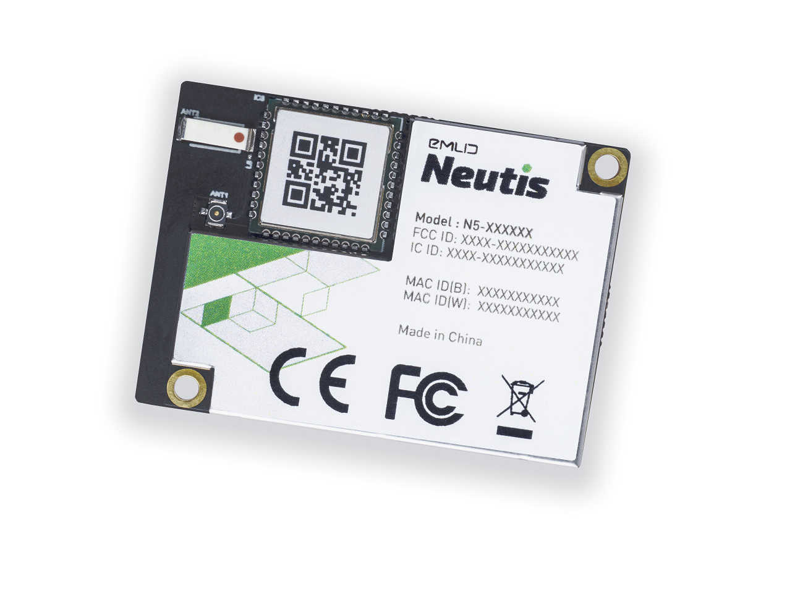
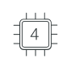
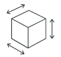
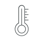
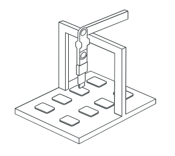
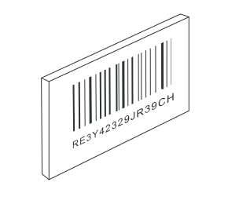
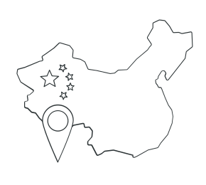
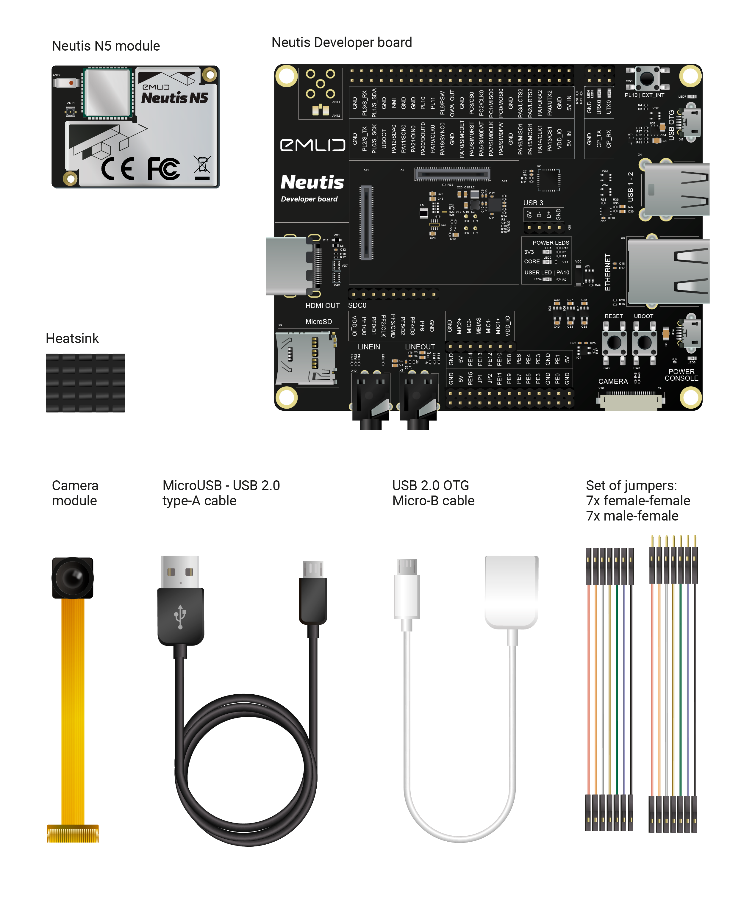

 

Neutis is a quad-core system on module for makers and hardware startups.

### Key features

<table id="index_features" style="border: 0;">
<tbody style="background-color: #fff;">
<tr>

<td style="text-align: center;">
  
</td>

<td style="text-align: center;">
  
</td>

<td style="text-align: center;">
  
</td>

<td style="text-align: center;">
  
</td>
</tr>

<tr>

<td>
  
<b>Quad-core</b>

  
 64-bit ARM® Cortex®-A53

</td>

<td>
  
<b>8GB/512MB</b>

  
eMMC / DDR3 RAM

</td>

<td>
  
<b>41x29.5x4.3mm</b>

  
Compact and light

</td>

<td>
  
<b>-20...+70 °C</b>

  
Extended temperature range

</tr>
<tr>

<td style="text-align: center;">
  
</td>

<td style="text-align: center;">
  
</td>

<td style="text-align: center;">
  
</td>

<td style="text-align: center;">
  
</td>

</tr>
<tr>
<td>
  
<b>Manufacturing tools</b>

  

    Software tool for parallel
    flashing of multiple units, component testing and serial number management</td>
 

<td>
  
<b>Yocto and OTA</b>

  

    Neutis BSP is based on Yocto build system. It comes with up-to-date Linux kernel based on mainline version and OTA support
  

</td>
<td>
  
<b>Wi-Fi and Bluetooth</b>

  

    Wi-Fi: 802.11 b/g/n.
    BT: 4.0 dual-mode BLE with onboard antenna and U.FL connector for optional external antenna.</td>
  

<td>
  
<b>Secure element</b>

  

    Tamper-resistant dedicated crypto chip for cryptographic keys and unique ID storage, hashing, random number generation and more
  

</td>
</tr>
</tbody>
</table>

For more complete description please proceed [here](specs/features.md).

### Manufacturing

We’ve made sure that you’re covered with everything you need for hassle-free manufacturing.

<table id="index_manufacturing" style="border: 0;">
<tbody style="background-color: #fff;">

<tr>

    <td style="text-align: center;" >
    
    </td>

    <td>
        
<b>Certification</b>

        
FCC and CE certification for Neutis modules is pending.

    </td>

    <td style="text-align: center;">
    
    </td>

    <td>
        
<b>Parallel flashing</b>

        
Manufacturing software tool can flash multiple units in parallel saving you time and reducing labor hours.

    </td>

</tr>

<tr>

    <td style="text-align: center;">
    
    </td>

    <td>
        
<b>Serial numbers</b>

        
Each module has a unique ID which allows you to conveniently manage your product batch using the manufacturing tool.

    </td>

    <td style="text-align: center;">
    
    </td>

    <td>
        
<b>No import duty for China</b>

        
Neutis can be obtained in China without any import duty, unlike other SoMs that may cost you 20% more on import. And for sure we ship worldwide.

    </td>
</tr>
</tbody>
</table>

### Development kit

</a>

### Getting started

- [Flashing and booting Neutis](quickstart/quickstart.md) with a Linux image
- [Connecting](connectivity/connectivity.md) to Neutis
- [Examples](examples/gpio.md)
- [Pinout](pinout/neutis.md) and [specifications](specs/features.md)
- [Building](yocto/tutorial.md) an own image with [Yocto](yocto/why.md)

### Collaboration

This document can be edited on [GitHub](https://github.com/emlid/neutis-docs) in Markdown. If you find any mistakes, typos or pieces that are not documented well enough simply open an issue or contribute by sending a pull request.
