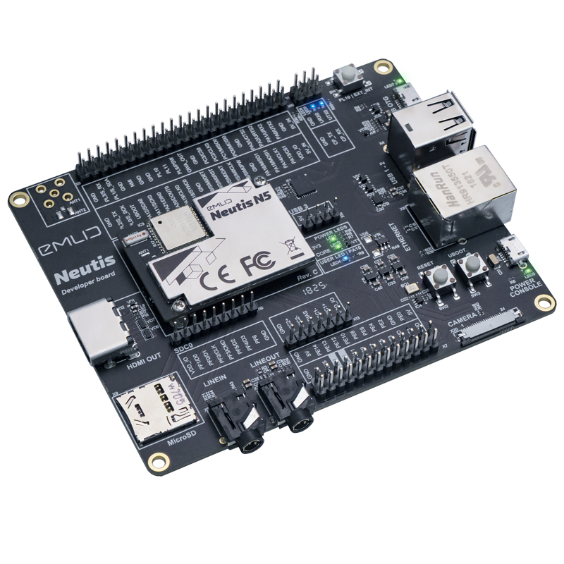

 

### Neutis

Awesome board

Features description of Neutis (hz, gb, 2xUSB etc)

More complete description [here](specs/features.md)

### Package contents

### Getting started

First step to begin working with Neutis is to [flash with a Linux image and boot](intro/flash.md)

### Collaboration

This document can be edited on [GitHub](https://github.com/emlid/neutis-docs) in Markdown. If you find any mistakes, typos or  pieces that are not documented well enough simply open an issue or contribute by sending a pull request.
